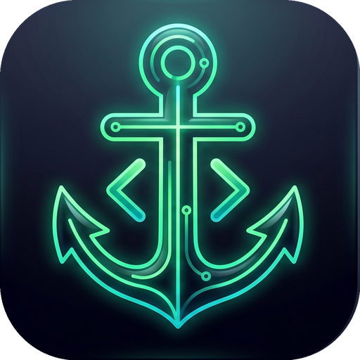

<div align="center">



# DevDock

### **Your Local Development Command Center**

*Automatically discover, understand, monitor, and launch every coding project on your computer — 100% locally & privately*

[](https://github.com/ArdaTkn/DevDock)
[](LICENSE)
[](https://github.com/ArdaTkn/DevDock)
[](https://github.com/ArdaTkn/DevDock/actions)

<p align="center">
  <a href="#-the-problem">The Problem</a> •
  <a href="#-core-features">Features</a> •
  <a href="#-quick-start">Quick Start</a> •
  <a href="#-architecture">Architecture</a> •
  <a href="#-security--privacy">Privacy</a> •
  <a href="#-roadmap">Roadmap</a> •
  <a href="#-contributing">Contributing</a>
</p>

---

</div>

> [!NOTE]
> **DevDock** runs entirely on your own machine. It reads only filesystem metadata (directory trees, marker files, Git porcelain) and **never uploads your source code anywhere**.

---

## 🎯 The Problem

Developers accumulate dozens or hundreds of coding projects across `~/Projects`, `~/Developer`, `~/Code`, `Documents`, and hidden corners of their disks. 

Without DevDock, answering simple questions requires constant terminal navigation:
- *Where is that old Flutter app or Rust CLI script I wrote last year?*
- *Which local ports (`localhost:3000`, `5173`, `8000`) are active right now?*
- *Do I have uncommitted Git changes before pushing?*
- *Is this project missing `.env` keys from `.env.example` or leaking keys to Git?*
- *Is this project missing `node_modules` or `.venv` dependencies?*

**DevDock is your local development command center.** It automatically discovers your projects, analyzes their tech stack, monitors active dev servers, audits health, and lets you open them in your preferred editor or terminal with a single click.

---

## ✨ Core Features

### 🛡️ Environment Sentinel & Secret Leak Prevention
- **`.env.example` vs `.env` Diff Checker:** Automatically extracts environment variable keys and warns you when required template keys are missing from your local `.env`. (Values are **never** read or stored for 100% privacy).
- **GitIgnore Secret Leak Auditor:** Scans for sensitive files (`.env`, `id_rsa`, `*.key`, `credentials.json`) and flags any unignored credentials with a 1-click **"+ Add to .gitignore"** button.
- **Runtime Toolchain Inspector:** Reads `.nvmrc`, `.python-version`, and `rust-toolchain.toml` to detect version mismatches against your installed runtime versions.

### 📁 Workspaces & Bulk Git Synchronization
- **Custom Project Workspaces:** Group related repositories into color-coded collections (e.g. *Client Work*, *Microservices*, *Open Source*).
- **Bulk `⬇️ Pull All`:** Synchronize and update all Git repositories in your active workspace simultaneously with animated background progress and detailed result reports.
- **Bulk `📋 Git Audit`:** Audit uncommitted changes across all workspace projects in one overview.

### 📦 Project Dependency Visualizer
- **Interactive Library Parser:** Automatically parses `package.json` (`dependencies` & `devDependencies`), `Cargo.toml`, and `requirements.txt` into a clean visual dependency list.

### 🎨 Custom Theme Customization
- **Curated Dark Themes:** Switch seamlessly between **Emerald Night**, **Cyberpunk Neon**, **Nordic Frost**, **Monokai Gold**, and **Dracula Pink**.

### 🟢 Active Dev Server & Port Monitoring
- **Smart Listening Port Scanner:** Automatically detects active TCP dev servers (`localhost:3000`, `5173`, `8000`, `5432`, `6379`, etc.).
- **Noise Filter:** Intelligently filters out background desktop applications (Spotify, Discord, Steam, Dropbox, system daemons).
- **Interactive Dev Grid:** Glassmorphism cards with pulsing status dots, PID badges, and 1-click browser launchers.

### 🔍 Magic Project Discovery & Detector Engine
- **Extensible Detector Architecture:** Instant recognition for **Git, Node.js, Python, Rust, Go, Flutter, .NET, Docker, Unity, and Java**.
- **Read-Only Git Metadata:** Shows current branch, clean/dirty status, uncommitted file counts (`modified`, `staged`, `untracked`), last commit message, and remote URL.

### 🐙 GitHub Integration & Quick Actions
- **Automatic Repository Parsing:** Resolves `owner/repo` from remote URLs.
- **1-Click Quick Actions:** Direct links to **Repository**, **Issues (`/issues`)**, and **Pull Requests (`/pulls`)**.

### 🏥 Project Health Audit & Custom Commands
- **Deterministic Health Scoring (0–100):** Evaluates missing dependencies (`node_modules`, `.venv`), documentation presence (`README.md`), and Git cleanliness.
- **Visual Health Tags & Indicators:** Color-coded badges (`🟢 Ready`, `🟡 Mod`, `🔴 Unhealthy`) on project cards and detail views.
- **Detected Package Scripts:** Reads `package.json` (`npm run dev`), `Cargo.toml` (`cargo run`), and `Makefile` scripts.
- **Custom Shell Commands:** Add your own project commands (`cargo watch`, `docker compose up`) saved locally in SQLite and trigger them in 1 click.

### 🏷️ Tags, Notes & Organization
- **Custom Project Tags:** Categorize projects (`open-source`, `client-work`, `side-project`).
- **Auto-Saved Markdown Notes:** Keep project TODOs, notes, and reminders saved per project in local SQLite.
- **Command Palette (`⌘K` / `Ctrl+K`):** Global instant search for projects, actions, and settings.
- **Recently Opened Strip:** Quick launcher for recently opened projects.
- **Configurable Editors & Terminals:** Auto-detects Antigravity IDE, Cursor, VS Code, Zed, Windsurf, JetBrains suite (WebStorm, PyCharm, IntelliJ, CLion, RustRover), iTerm2, Kitty, Alacritty, Warp, Terminal.app, etc.

---

## ⚡ Quick Start & Installation

Launch DevDock instantly from any terminal window :

```bash
# 1. Clone the repository & link the CLI globally
git clone https://github.com/ArdaTkn/DevDock.git
cd DevDock && npm install && npm link

# 2. Type 'devdock' anywhere in your terminal to launch DevDock!
devdock
```

### 💻 DevDock CLI Subcommands

```bash
# Launch DevDock GUI App
devdock

# Check active listening dev ports (3000, 5173, 8000...)
devdock ports

# Pull latest code from GitHub & rebuild automatically
devdock update

# Show DevDock system status & database info
devdock status

# Scan specific folder
devdock scan ~/Projects

# Print CLI help
devdock help
```

> [!TIP]
> After running `npm link` once, simply typing `devdock` in any terminal opens DevDock directly.

---

## 🏛️ Architecture

```
┌─────────────────────────────────────────────────────────┐
│              Frontend: React 18 + TypeScript + Vite     │
│   (Zustand State, Lucide Icons, Modern Dark UI Themes) │
└────────────────────────────┬────────────────────────────┘
                             │ Tauri 2 IPC Commands
┌────────────────────────────▼────────────────────────────┐
│                  Backend: Rust + Tauri 2                │
│   • discovery/  (Smart parallel directory traversal)    │
│   • security/   (.env diffing & secret leak prevention) │
│   • git/        (Read-only Git CLI porcelain parser)    │
│   • processes/  (Smart filtering dev listening ports)   │
│   • docker/     (Docker container inspector)            │
│   • health/     (Deterministic project health audit)   │
│   • system/     (Safe OS launcher & script runner)      │
│   • storage/    (Embedded SQLite - rusqlite)            │
│   • watch/      (Incremental FS events - notify crate)  │
└────────────────────────────┬────────────────────────────┘
                    ┌────────▼────────┐
                    │  SQLite Database│ (Metadata & paths only)
                    └─────────────────┘
```

For full architecture details, check out [`docs/ARCHITECTURE.md`](docs/ARCHITECTURE.md).

---

## 🛡️ Security & Privacy

- **Local-First & Offline:** DevDock works 100% offline. No cloud, no external servers, no user accounts.
- **No Source Code Uploads:** DevDock scans only file/folder names, marker files (like `package.json` script keys), and Git status. Your source code, `.env` files, and secrets are **never** read or transmitted.
- **Zero Telemetry:** No tracking, no background pinging, no analytics.
- **Safe Process Spawning:** Every editor, terminal, or script runner uses explicit argv (`Command::new(bin).args(...)`) rather than raw shell execution, preventing shell-injection vulnerabilities.

Read our full [Security Policy](SECURITY.md) and [`docs/SECURITY.md`](docs/SECURITY.md).

---

## 🗺️ Roadmap (v0.5 ➔ v1.0)

- [x] **v0.1.0** — Core scanner, Git metadata parser, project card grid, technology detectors.
- [x] **v0.2.0** — Command Palette (`⌘K`), FileSystem Watcher (`notify`), Recently Opened strip, Code Editor & Terminal selector.
- [x] **v0.3.0** — Smart Listening Port scanner (`localhost:3000`, `5173`), Docker container inspector, deterministic project health audit.
- [x] **v0.4.0** — GitHub integration, custom project tags, auto-saved Markdown notes, configurable custom shell commands.
- [x] **v0.5.0** — Project dependency visualizer, 6 custom dark themes, global terminal CLI (`devdock`, `devdock update`, `devdock ports`).
- [x] **v0.6.0** — Workspaces & Project Collections, Bulk Git sync ("⬇️ Pull All", "📋 Git Audit"), in-app workspace manager.
- [x] **v0.7.0** — `.env.example` vs `.env` diff inspector, GitIgnore secret leak prevention, runtime toolchain version warnings.
- [ ] **v0.8.0** *(Next)* — Disk Space Hog visualizer, 1-click safe build cache cleaner (`node_modules`, `target`, `.dart_tool`), stale project detector.
- [ ] **v0.9.0** — macOS Menu Bar & Windows Tray popover widget, global `⌥ Space` floating HUD, dev server crash notifications.
- [ ] **v1.0.0** — Privacy-first offline local AI (Ollama / Apple Neural Engine), semantic codebase search, interactive architecture graph.

Check out [`docs/PLAN.md`](docs/PLAN.md) for full roadmap details.

---

## 🤝 Contributing

Contributions are warmly welcomed! Please read [`CONTRIBUTING.md`](CONTRIBUTING.md) to learn how to add new technology detectors or contribute to the Tauri/React codebase. Please follow our [Code of Conduct](CODE_OF_CONDUCT.md).

---

## 📄 License

DevDock is released under the **[MIT License](LICENSE)** © [Arda Tekin](https://github.com/ArdaTkn).
